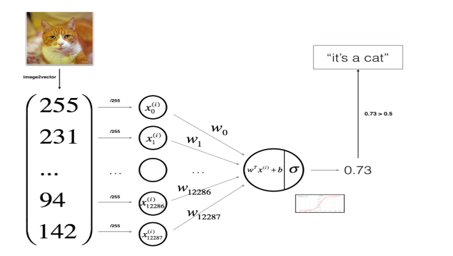
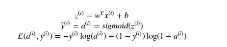
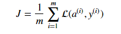
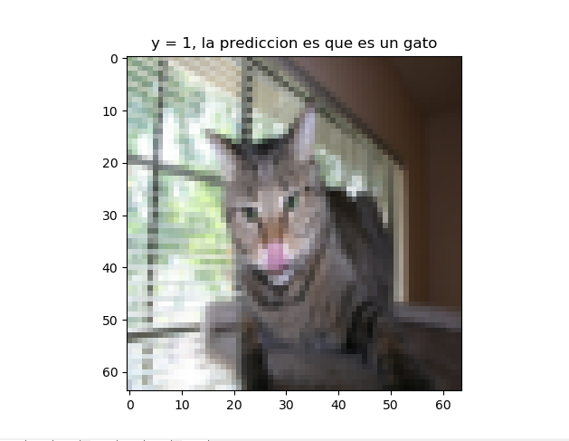
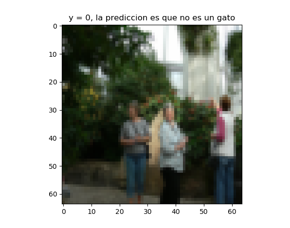
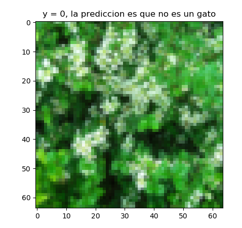
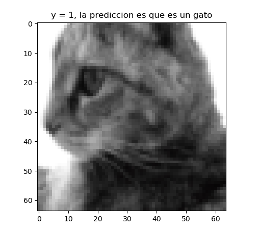
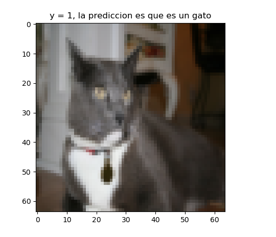
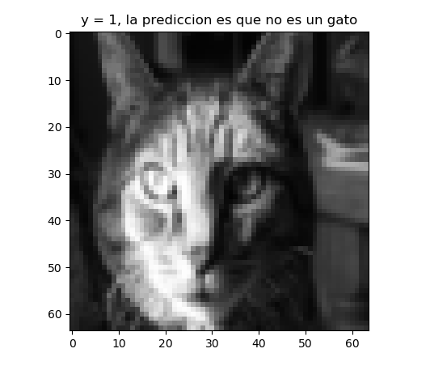

# Cat Classifier

Modelo de regresión lógica compuesto por una red neuronal de una sola neurona, equivalente a un modelo de regresión clásico.
Los resultados obtenidos son:

Precision de entrenamiento: 99.52153110047847 % (no es necesario, pero es una buena y sana práctica mostrarlo)

Precicion de test: 70.0 %

Como datos adicionales decir que se ha inicializado la matriz de pesos W a ceros, práctica no recomendada para cuando se tenga más de una neurona por capa. Se ha usado como función de activación en la capa de salida (y única) la función sigmoide, ya que se trata de un problema de clasificación. Para el backpropagation usamos el algoritmo de descenso del gradiente.

## El modelo

Para un ejemplar x_i: 

El coste se calcula para todos los ejemplares:

## Algunos ejemplos, 5 aciertos y el último fallido

